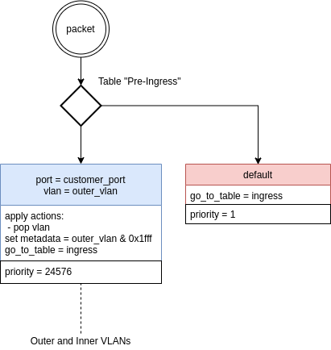
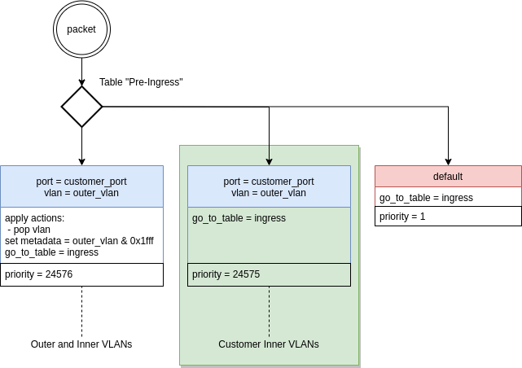

# Feature: Flow statistics per vlan

#### Gather flow statistics per VLAN selected by a user 


## API

### Specify selected VLANs by flow create

`POST https://{host}/v2/flows/{flow_id}/`
```json
{
  "flow_id": "f12345678",
  "statistics": {
  	"vlan": [3, 4, n]
  }
  ...
}

```

### Modify VLANs by Put and Patch

`PATCH https://{host}/v2/flows/{flow_id}/`
`PUT https://{host}/v2/flows/{flow_id}/`
```json
{
  "flow_id": "f12345678",
  "statistics": {
  	"vlan": [5, 6] <- New VLANs 
  }
  ...
}
```

### Delete VLANs by Patch

`PATCH https://{host}/v2/flows/{flow_id}/`
`PUT https://{host}/v2/flows/{flow_id}/`
```json
{
  "flow_id": "f12345678",
  "statistics": {
  	"vlan": [] <- clean
  }
  ...
}
```

## Rules

### Full port flow scenario 

#### Current rules



#### Proposed rules




## Affected components

- NB
- Flow CRUD + Sync
- Statistics collection and store
- DB layer
- Floodlight
- Production: grafana dashboards
- GUI


