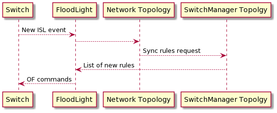
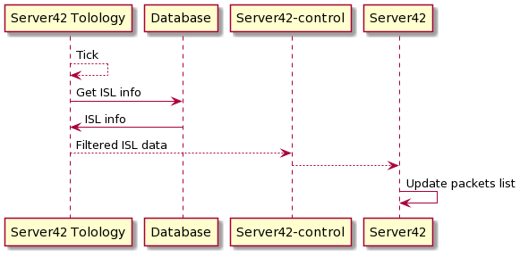
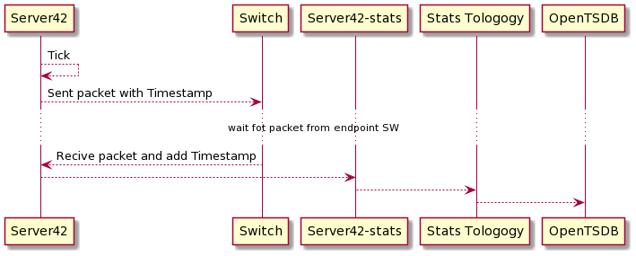
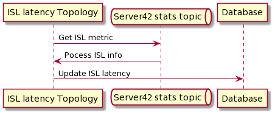

# Server42 ISL RTT feature (draft design)

---
 
## requirements specification

- get ISL info from DB and update Packet generator
- update rules on switches on ISL/PORT event
- put new metrics to OpenTSDB
- update information on ISL with new latency
- support only WB switches on both ISL endpoints
- support existed global\local server42 swithers

---

## affected components

- network topology
- server42 topology
- server42-control
- server42-stats
- server42
- isl-latency topology
- stats topology
- switchmanager topology
- server42-storm-stub

---

## High view diagramm

### Install rules on switch

### Update packet generator

### Geting metrics

### Update ISL latency

