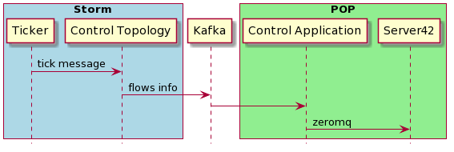
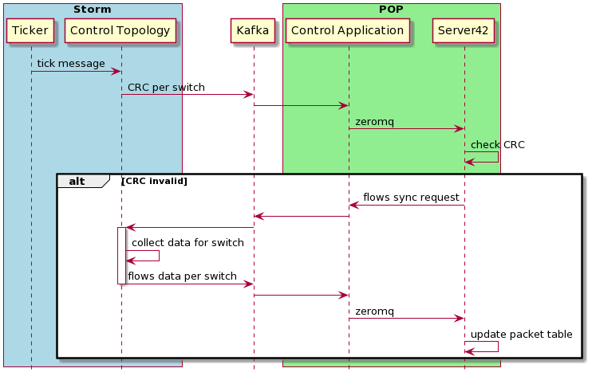
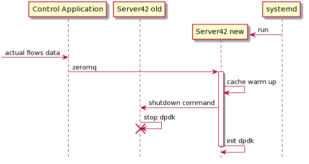

# Server42 LCM

## requirements specification

- We have three components, and all of them must be in a consistent state
- If the component is going down, we must restart it and achieve a consistent state
- Order of components restarts or deployment unspecified
- Survive after network issues
- Handle 1m flows
- Handle the situation when a component or network is going down in the middle of state recovering
- Components must work in network isolation

## design

### stage 1

Periodically send all information about the network.

- pros
  - stable and predictability
  - easy to implement and test
  - fit to requirements specification
- cons
  - big load on Kafka on scale

### stage 2

Enable Kafka batching and compress features then check system on 1m flows.

### stage 3

To reduce the amount of data in each synchronization packet, send only CRC of data for a concrete switch. If CRC is not valid for the switch server42 will ask entire info from control application.

### stage 4

To avoid statistics drop on restart or update run the new version of server42 and wait till the new version gets all entire info from the control application and then shutdown the old application.

